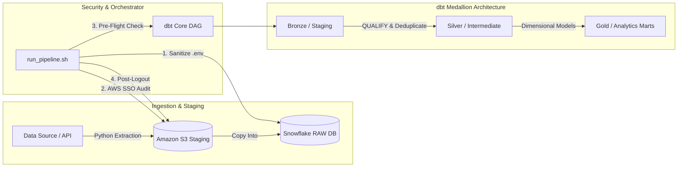

# End-to-End Modern Data Stack Pipeline: The Lake House

An automated, production-grade data engineering pipeline that extracts raw source data, handles cross-platform incremental loading, and orchestrates complex transformations using **dbt Core** and a cloud-native **Snowflake Enterprise Data Warehouse**.

The project features a defensive, decoupled orchestration architecture that isolates environmental parameters from backend data code using automated Bash wrappers and Python execution scripts.

---

## 🏗️ Architecture Overview

The pipeline follows a modular, scalable ELT (Extract, Load, Transform) architecture leveraging corporate infrastructure patterns:




** Cloud Infra & Warehousing: Snowflake (Enterprise Edition) utilizing decoupled compute/storage layers and AWS (Amazon S3) for data lake staging.

** Transformation & Modeling: dbt Core managing the full Directed Acyclic Graph (DAG), column descriptions, and referential integrity assertions.

** Orchestration & Automation: Multi-tiered automation using a robust shell controller (run_pipeline.sh) feeding into a dedicated Python environment supervisor (dbt_run.py).

---

## 🚀 Key Engineering Features

** Cross-Platform Security & Env-Parsing: Orchestrator natively reads, sanitizes, and strips out Windows carriage returns (\r), leading/trailing whitespaces, and inline comments from local .env files to guarantee platform-agnostic execution stability within Linux/WSL environments.

** Defensive AWS SSO Orchestration: Implements pre-flight aws sts get-caller-identity checks to verify session health. If a token is expired or missing, it dynamically initiates an interactive device-code OAuth flow (aws sso login), pausing the process for safe browser authentication before advancing.

** Pre-Flight Structural Validation: Programmatically tests the dbt compiler schema health via silent checks (dbt compile) prior to kicking off data actions, guaranteeing that configuration mistakes fail-fast and immediately force-kill stale security sessions.

** Robust Data Deduplication: Leverages windowed analytical syntax (QUALIFY row_number() OVER (...)) and MD5 surrogate key hashing inside dbt models to eliminate duplicate source transactions and protect downstream constraints.

** Session Hardening & Security Posture: To enforce zero-trust local constraints, the orchestrator triggers a mandatory, post-execution token invalidation loop (aws sso logout) regardless of a successful run or an extraction abort to prevent lingering cloud sessions.
---

## 🛠️ Local Setup & Execution

### 1. Prerequisites
* Python 3.10+ (configured inside a local dbt-env virtual environment)
* AWS CLI v2 configured with an SSO profile
* Snowflake Account with functional role privileges

### 2. Configure Credentials
** Create a local .env file in the project root to house your external references:

    AWS_S3_PROFILE=your-aws-sso-profile-name


** Ensure your local `~/.dbt/profiles.yml` is configured to map to your Snowflake target database environment:

    ```yaml
    the_lake_house:
      target: dev
      outputs:
        dev:
          type: snowflake
          account: [your-snowflake-account-identifier]
          user: [your-username]
          password: [your-password]
          role: [your-functional-role, e.g., ACCOUNTADMIN]
          database: [your-target-db]
          warehouse: [your-virtual-warehouse]
          schema: [your-target-schema]
          threads: 4
      
3. Running the Pipeline via the Orchestrator
The pipeline is entirely self-contained. Grant executable access to the main controller shell script and kick it off:

Bash
# Clone the repository
git clone [https://github.com/lracine-ghub/The-Lake-House.git](https://github.com/lracine-ghub/The-Lake-House.git)
cd The-Lake-House

# Clone the repository and navigate to the project directory
git clone [https://github.com/lracine-ghub/The-Lake-House.git](https://github.com/lracine-ghub/The-Lake-House.git)
cd The-Lake-House

# Grant executable permissions to the controller
chmod +x run_pipeline.sh

# Fire the end-to-end orchestration sequence
./run_pipeline.sh

📊 Lineage & Documentation
Data dependency charts, schema definitions, and model validation constraints are compiled dynamically. To generate the runtime documentation and spin up the structural DAG web server, execute:

Bash
  dbt docs generate
  dbt docs serve