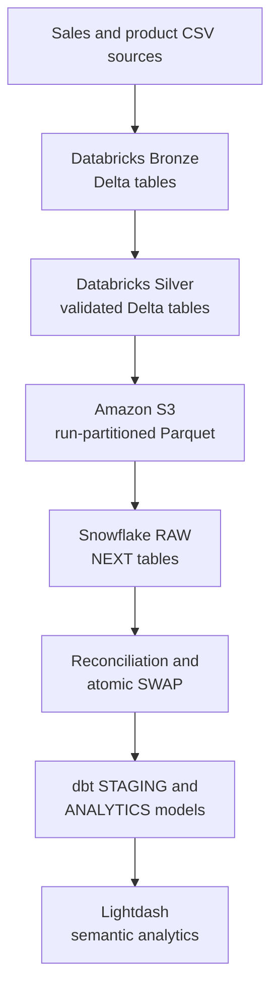
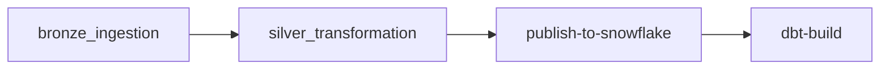
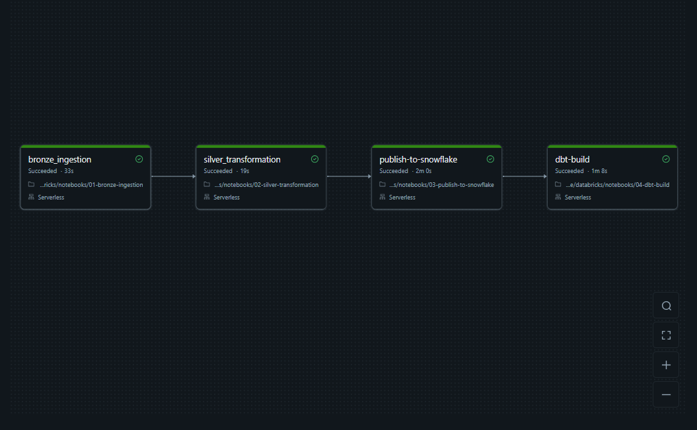
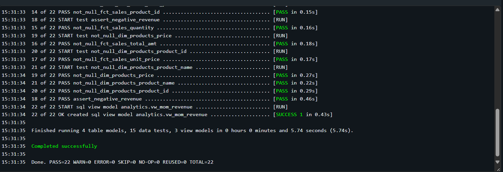
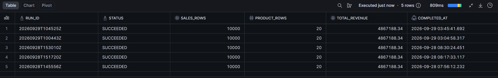
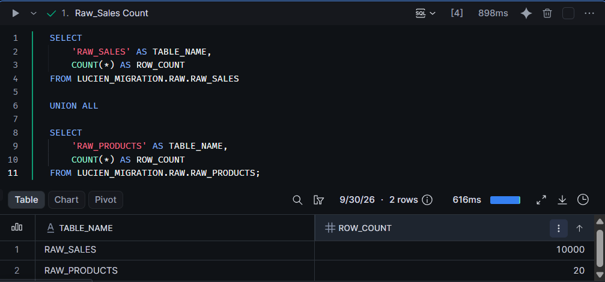

# The Lake House

An end-to-end data engineering portfolio project that uses Databricks and PySpark to ingest and validate source data, Amazon S3 as the cross-platform handoff layer, Snowflake as the analytical warehouse, and dbt Core to build tested business-ready models.

The project demonstrates production-style patterns—including Medallion processing, distributed Parquet writes, run-specific storage paths, source-to-target reconciliation, atomic table promotion, RSA key-pair authentication, and automated dbt testing—using reproducible sample sales data.

## Architecture


```mermaid
flowchart TD
    A["Sales and product CSV sources"] --> B["Databricks Bronze<br/>Delta tables"]
    B --> C["Databricks Silver<br/>validated Delta tables"]
    C --> D["Amazon S3<br/>run-partitioned Parquet"]
    D --> E["Snowflake RAW<br/>NEXT tables"]
    E --> F["Reconciliation and<br/>atomic SWAP"]
    F --> G["dbt STAGING and<br/>ANALYTICS models"]
    G --> H["Lightdash<br/>semantic analytics"]
```

### Layer ownership

| Layer | Platform | Responsibility |
|---|---|---|
| Source | Repository CSV files | Reproducible sales and product inputs |
| Bronze | Databricks Delta Lake | Raw ingestion with source and load metadata |
| Silver | Databricks Delta Lake | Type casting, validation, deduplication, and standardization |
| Handoff | Amazon S3 | Distributed Snappy Parquet files organized by pipeline run |
| Raw warehouse | Snowflake | Bulk-loaded source-aligned tables |
| Gold | Snowflake + dbt Core | Tested staging models, dimensions, facts, and analytics views |
| BI | Lightdash | Downstream semantic and self-service analytics |

Snowflake and dbt are the authoritative Gold layer. The repository's `03-gold-analytics` notebook is retained as a Databricks learning artifact and is not part of the production-style job.

## Orchestrated workflow

The Databricks job runs four dependent notebook tasks:


```mermaid
flowchart LR
    A["bronze_ingestion"] --> B["silver_transformation"]
    B --> C["publish-to-snowflake"]
    C --> D["dbt-build"]
```

| Task | Notebook | Purpose |
|---|---|---|
| `bronze_ingestion` | `01-bronze-ingestion.ipynb` | Load source files into Bronze Delta tables |
| `silver_transformation` | `02-silver-transformation.ipynb` | Clean, standardize, validate, and deduplicate data |
| `publish-to-snowflake` | `03-publish-to-snowflake.ipynb` | Write distributed Parquet files to S3 and promote validated Snowflake tables |
| `dbt-build` | `04-dbt-build.ipynb` | Build and test Snowflake staging and analytics models |


## Technology stack

- **Processing and orchestration:** Databricks, PySpark, Delta Lake, Databricks Jobs
- **Storage:** Amazon S3, Snappy Parquet
- **Warehouse:** Snowflake
- **Transformation and testing:** dbt Core, dbt-snowflake, dbt-utils
- **Analytics:** Lightdash
- **Languages:** Python, SQL, T-SQL, Bash
- **Engineering workflow:** Git, GitHub, pull requests
- **Security:** Databricks Secrets, encrypted RSA private key, Snowflake key-pair authentication

## Engineering features

### Distributed data handoff

Silver DataFrames are written directly from Spark to run-specific S3 paths:

```text
s3://<your-bucket>/raw/databricks/raw_sales/run_id=<timestamp>/
s3://<your-bucket>/raw/databricks/raw_products/run_id=<timestamp>/
```

Snowflake loads only `.parquet` objects, excluding Spark marker files such as `_SUCCESS`.

### Safe Snowflake promotion

Each pipeline run:

1. Creates transient `RAW_SALES_NEXT` and `RAW_PRODUCTS_NEXT` tables.
2. Loads the current run's Parquet files with Snowflake `COPY INTO`.
3. Aborts on file or parsing errors.
4. Reconciles Spark and Snowflake row counts.
5. Checks primary-key uniqueness and aggregate revenue.
6. Promotes validated data with atomic `ALTER TABLE ... SWAP WITH`.
7. Records the completed run in `PIPELINE_RUN_AUDIT`.

The live raw tables remain unchanged when validation fails.

### Automated data quality

The dbt task resolves dependencies, validates the Snowflake connection, compiles the project, builds upstream staging and downstream mart models, and runs associated tests.

Validated project result:

```text
10,000 sales records
20 product records
7 dbt models
15 data tests
PASS=22 WARN=0 ERROR=0 SKIP=0
```

Tests cover required identifiers and measures, accepted numeric ranges, and negative-revenue prevention.

### Secure authentication

The pipeline does not commit Snowflake credentials or private-key files. Databricks Secrets supplies configuration and an encrypted Base64-encoded RSA private key at runtime. The dbt notebook writes the decoded encrypted key and `profiles.yml` only to a permission-restricted temporary directory, then removes both after execution.

## Repository structure

```text
The-Lake-House/
├── databricks/
│   └── notebooks/
│       ├── 01-bronze-ingestion.ipynb
│       ├── 02-silver-transformation.ipynb
│       ├── 03-gold-analytics.ipynb
│       ├── 03-publish-to-snowflake.ipynb
│       ├── 04-dbt-build.ipynb
│       └── dbt_requirements.txt
├── docs/
│   ├── images/
│   │   ├── databricks-job-success.png
│   │   └── snowflake-pipeline-audit.png
│   │   ├── snowflake-row-counts.png
│   │   └── dbt-build-success.png
│   │   └── FlowChart.jpg
├── sales_pipeline/
│   ├── data/raw/
│   ├── models/
│   │   ├── staging/
│   │   └── marts/
│   ├── snapshots/
│   ├── tests/
│   ├── dbt_project.yml
│   └── packages.yml
├── requirements-dev.txt
└── README.md
```

## Setup

### Prerequisites

- A Databricks workspace with serverless compute
- Unity Catalog access to an Amazon S3 external location
- A Snowflake account, warehouse, database, role, and external S3 stage
- A Snowflake user configured for RSA key-pair authentication
- A Databricks Git folder connected to this repository

### Databricks secret scope

Create a secret scope named `lakehouse` and populate these keys:

```text
snowflake-user
snowflake-account
snowflake-warehouse
snowflake-database
snowflake-schema
snowflake-role
snowflake-private-key-b64
snowflake-private-key-passphrase
```

Use an encrypted RSA private key. Never commit the private key, passphrase, generated `profiles.yml`, or local environment files.

### External storage

Configure:

1. A Unity Catalog external location that grants Databricks access to the S3 bucket.
2. A Snowflake storage integration and external stage that can read the Databricks output prefix.
3. Appropriate least-privilege access for the Databricks and Snowflake identities.

The publishing notebook expects the Snowflake external stage `RAW_S3_STAGE`. Change the notebook configuration if your stage uses a different name.

### Databricks job

Create the four notebook tasks shown above and configure each task to depend on the preceding task. Use the repository's `main` branch for the validated workflow.

The dbt notebook installs its pinned dependencies from:

```text
databricks/notebooks/dbt_requirements.txt
```

Run the complete workflow from **Jobs & Pipelines** and confirm that all four tasks finish successfully.

## Verification

After a successful run, verify the most recent pipeline audit in Snowflake:

```sql
SELECT *
FROM LUCIEN_MIGRATION.RAW.PIPELINE_RUN_AUDIT
ORDER BY COMPLETED_AT DESC;
```

Confirm the promoted raw-table counts:

```sql
SELECT COUNT(*) FROM LUCIEN_MIGRATION.RAW.RAW_SALES;
SELECT COUNT(*) FROM LUCIEN_MIGRATION.RAW.RAW_PRODUCTS;
```

Then validate the dbt-created objects in the `STAGING` and `ANALYTICS` schemas.

## Local dbt development

Install the pinned development dependencies:

```bash
python -m venv .venv
source .venv/bin/activate
pip install -r requirements-dev.txt
```

Configure a local dbt profile securely, then run:

```bash
cd sales_pipeline
dbt deps
dbt debug
dbt build --select +path:models/marts
```

Do not commit `.env`, `profiles.yml`, private keys, or passphrases.

## Design decisions

- **Databricks owns Bronze and Silver:** Spark handles scalable ingestion and validation.
- **S3 decouples platforms:** Parquet provides an efficient and auditable handoff between Databricks and Snowflake.
- **Snowflake and dbt own Gold:** Existing warehouse models and Lightdash semantics remain authoritative.
- **Batch COPY is used for this workload:** Snowflake bulk loading is appropriate for run-partitioned files; streaming ingestion can be added when continuous arrival is required.
- **Validation precedes promotion:** Reconciliation and atomic swaps keep incomplete loads away from downstream consumers.

## Pipeline Execution Evidence

### Databricks Workflow



### dbt Build and Automated Tests



### Snowflake Pipeline Audit



### Snowflake Raw-Table Reconciliation



## Portfolio scope

This repository is a portfolio implementation designed to demonstrate modern data engineering patterns. It uses generated sample data and production-style controls; it is not presented as an employer-operated production system.
