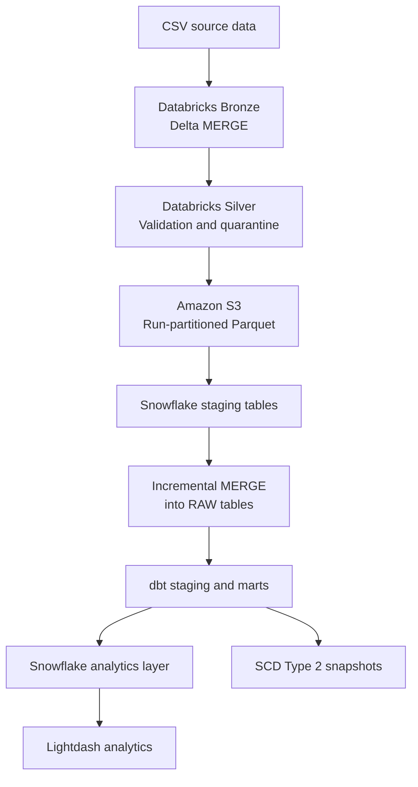
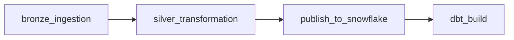

# The Lake House

[](https://github.com/lracine93-ghub/The-Lake-House/actions/workflows/quality-gates.yml)

A production-style data engineering pipeline that incrementally processes sales and product data through Databricks, Delta Lake, Amazon S3, Snowflake, and dbt Core.

The project demonstrates idempotent ingestion, Medallion Architecture, Delta `MERGE` processing, data quarantine, cross-platform bulk loading, Snowflake key-pair authentication, source freshness enforcement, SCD Type 2 history, automated testing, deployment as code, and CI/CD quality gates.

## Architecture


```mermaid
flowchart TD
    A["CSV source data"] --> B["Databricks Bronze<br/>Delta MERGE"]
    B --> C["Databricks Silver<br/>Validation and quarantine"]
    C --> D["Amazon S3<br/>Run-partitioned Parquet"]
    D --> E["Snowflake staging tables"]
    E --> F["Incremental MERGE<br/>into RAW tables"]
    F --> G["dbt staging and marts"]
    G --> H["Snowflake analytics layer"]
    G --> I["SCD Type 2 snapshots"]
    H --> J["Lightdash analytics"]
```

## What This Project Demonstrates

- Incremental, idempotent Bronze and Silver pipelines
- Explicit PySpark schemas and deterministic record hashing
- Delta Lake `MERGE` operations instead of destructive overwrites
- Quarantine tables and fail-fast data-quality controls
- A shared pipeline run ID across all orchestration tasks
- Distributed Parquet handoff from Databricks to Amazon S3
- Incremental Snowflake publishing with audit history
- Safe `NO_CHANGES` handling for repeat pipeline runs
- dbt source freshness, transformations, tests, and snapshots
- RSA key-pair authentication using Databricks Secrets
- Databricks Asset Bundle deployment
- GitHub Actions validation on pushes and pull requests

## Layer Ownership

| Layer | Platform | Responsibility |
|---|---|---|
| Source | Repository CSV files | Reproducible sales and product inputs |
| Bronze | Databricks Delta Lake | Append-only ingestion, lineage metadata, and record hashes |
| Silver | Databricks Delta Lake | Validation, deduplication, SCD1-style merges, and quarantine |
| Handoff | Amazon S3 | Run-partitioned Snappy Parquet files |
| Raw warehouse | Snowflake | Incrementally maintained source-aligned tables |
| Gold | Snowflake and dbt Core | Staging models, dimensions, facts, analytics views, and snapshots |
| BI | Lightdash | Semantic and self-service analytics |

Snowflake and dbt are the authoritative Gold layer. The `03-gold-analytics.ipynb` notebook remains in the repository as a Databricks learning artifact and is not part of the deployed workflow.

## Orchestrated Workflow

The Databricks workflow contains four dependent tasks:


```mermaid
flowchart LR
    A["bronze_ingestion"] --> B["silver_transformation"]
    B --> C["publish_to_snowflake"]
    C --> D["dbt_build"]
```

| Task | Notebook | Responsibility |
|---|---|---|
| `bronze_ingestion` | `01-bronze-ingestion.ipynb` | Read source files with explicit schemas and insert unseen records into Bronze Delta tables |
| `silver_transformation` | `02-silver-transformation.ipynb` | Standardize, deduplicate, quarantine invalid rows, and merge valid records into Silver |
| `publish_to_snowflake` | `03-publish-to-snowflake.ipynb` | Export changed Silver records to S3 and incrementally publish them to Snowflake |
| `dbt_build` | `04-dbt-build.ipynb` | Check source freshness, build and test analytical models, and maintain product snapshots |

The workflow enforces:

- Maximum concurrency of one run
- Queuing for overlapping requests
- Task-specific timeouts
- Automatic retries
- Failure notifications
- A shared `pipeline_run_id`
- Serverless Databricks compute

## Incremental Processing

### Bronze

Bronze ingestion:

1. Reads CSV files using explicit Spark schemas.
2. Adds source, file, run ID, ingestion timestamp, and record-hash metadata.
3. Removes duplicate source records.
4. Uses insert-only Delta `MERGE` operations keyed by `record_hash`.
5. Validates table schemas and operation metrics after loading.

Previously ingested records are not rewritten.

### Silver

Silver transformation:

1. Reads the Bronze Delta tables.
2. Applies deterministic deduplication.
3. Standardizes column names and data types.
4. Separates valid and invalid records.
5. Writes rejected rows to quarantine tables.
6. Uses SCD1-style Delta `MERGE` operations for valid records.
7. Fails the pipeline if quality thresholds are violated.

### Snowflake Publishing

Only records produced by the current pipeline run are selected for incremental publishing.

Changed Silver data is written to paths such as:

```text
s3://<bucket>/raw/databricks/silver_sales/run_id=<pipeline_run_id>/
s3://<bucket>/raw/databricks/silver_products/run_id=<pipeline_run_id>/
```

The publishing task then:

1. Creates or validates Snowflake target and audit tables.
2. Loads Parquet files into staging tables with `COPY INTO`.
3. Merges staged records into production RAW tables.
4. Reconciles source and target row counts.
5. Records run status, row counts, revenue, and S3 paths.
6. Records `NO_CHANGES` without writing empty Parquet files or modifying production tables.

The process can also run in an explicit full-publish mode when a controlled backfill is required.

## dbt Analytics Engineering

The dbt task performs:

1. `dbt deps`
2. `dbt debug`
3. Model discovery and compilation
4. Source freshness validation
5. Staging and mart model builds
6. Automated data tests
7. SCD Type 2 product snapshot execution

Validated project result:

```text
10,000 sales records
20 product records
7 dbt models
24 data tests
2 configured sources
1 SCD Type 2 snapshot
PASS=31 WARN=0 ERROR=0 SKIP=0
```

Tests cover:

- Required identifiers
- Primary-key uniqueness
- Source-layer null validation
- Numeric accepted ranges
- Negative-revenue prevention
- Product dimension integrity

Source freshness warns after 30 days and fails after 90 days based on the Snowflake RAW `updated_at` fields.

Product attribute changes are maintained in:

```text
LUCIEN_MIGRATION.SNAPSHOTS.SCD_PRODUCTS
```

## Security

The repository does not store operational credentials, private keys, passphrases, or generated dbt profiles.

Runtime security includes:

- Encrypted RSA private-key authentication to Snowflake
- Base64-encoded key storage in Databricks Secrets
- Temporary permission-restricted key and profile files
- No password authentication in pipeline code
- `.gitignore` protection for keys, profiles, environment files, artifacts, and local tooling
- Rewritten Git history with obsolete binaries and sensitive artifacts removed

## Deployment as Code

The Databricks job is defined through a Databricks Asset Bundle:

```text
databricks.yml
resources/lakehouse.job.yml
```

Validate the bundle:

```bash
databricks bundle validate \
  --target dev \
  --profile lakehouse-workspace
```

Deploy it:

```bash
databricks bundle deploy \
  --target dev \
  --profile lakehouse-workspace
```

Run the complete workflow:

```bash
databricks bundle run lakehouse_medallion_pipeline \
  --target dev \
  --profile lakehouse-workspace
```

## CI/CD Quality Gates

GitHub Actions validates every pull request and relevant branch push.

The workflow checks:

- Databricks notebook JSON integrity
- Python syntax
- Databricks bundle YAML syntax
- Pinned dbt dependency installation
- dbt project parsing
- Deprecated dbt configuration usage

The CI process uses placeholder environment values and does not connect to Snowflake or expose runtime credentials.

## Technology Stack

- **Processing:** Databricks, PySpark, Delta Lake
- **Orchestration:** Databricks Jobs and Asset Bundles
- **Storage:** Amazon S3 and Snappy Parquet
- **Warehouse:** Snowflake
- **Transformation:** dbt Core and dbt-snowflake
- **Testing:** dbt-utils, custom SQL tests, and GitHub Actions
- **Analytics:** Lightdash
- **Languages:** Python, SQL, T-SQL, Bash, YAML
- **Security:** Databricks Secrets and Snowflake RSA key-pair authentication
- **DevOps:** Git, GitHub, pull requests, and CI/CD

## Repository Structure

```text
The-Lake-House/
├── .github/
│   ├── dbt-ci-profiles.yml
│   └── workflows/
│       └── quality-gates.yml
├── databricks/
│   └── notebooks/
│       ├── 01-bronze-ingestion.ipynb
│       ├── 02-silver-transformation.ipynb
│       ├── 03-gold-analytics.ipynb
│       ├── 03-publish-to-snowflake.ipynb
│       ├── 04-dbt-build.ipynb
│       └── dbt_requirements.txt
├── docs/
│   └── images/
├── resources/
│   └── lakehouse.job.yml
├── sales_pipeline/
│   ├── data/raw/
│   ├── models/
│   │   ├── staging/
│   │   └── marts/
│   ├── snapshots/
│   ├── tests/
│   ├── dbt_project.yml
│   └── packages.yml
├── databricks.yml
├── requirements-dev.txt
└── README.md
```

## Prerequisites

- Databricks workspace with serverless compute
- Databricks CLI with OAuth authentication
- Unity Catalog access to an Amazon S3 external location
- Snowflake account, warehouse, database, role, and external S3 stage
- Snowflake user configured for RSA key-pair authentication
- GitHub repository access

## Databricks Secrets

Create a secret scope named `lakehouse` containing:

```text
snowflake-user
snowflake-account
snowflake-warehouse
snowflake-database
snowflake-schema
snowflake-role
snowflake-private-key-b64
snowflake-private-key-passphrase
```

Never commit private keys, passphrases, generated `profiles.yml` files, or environment files.

## Local dbt Development

Create an isolated environment:

```bash
python3 -m venv .venv
source .venv/bin/activate
python -m pip install --upgrade pip
python -m pip install -r requirements-dev.txt
```

Configure `~/.dbt/profiles.yml` with environment-variable references, then run:

```bash
cd sales_pipeline
dbt deps
dbt debug
dbt source freshness
dbt build --select +path:models/marts
dbt snapshot
```

## Verification

Review the latest Snowflake publishing runs:

```sql
SELECT *
FROM LUCIEN_MIGRATION.RAW.PIPELINE_RUN_AUDIT
ORDER BY COMPLETED_AT DESC;
```

Validate RAW table counts:

```sql
SELECT 'RAW_SALES' AS TABLE_NAME, COUNT(*) AS ROW_COUNT
FROM LUCIEN_MIGRATION.RAW.RAW_SALES

UNION ALL

SELECT 'RAW_PRODUCTS' AS TABLE_NAME, COUNT(*) AS ROW_COUNT
FROM LUCIEN_MIGRATION.RAW.RAW_PRODUCTS;
```

Validate the product snapshot:

```sql
SELECT
    COUNT(*) AS SNAPSHOT_ROWS,
    COUNT(DISTINCT PRODUCT_ID) AS DISTINCT_PRODUCTS,
    COUNT_IF(DBT_VALID_TO IS NULL) AS CURRENT_VERSIONS,
    COUNT_IF(DBT_VALID_TO IS NOT NULL) AS HISTORICAL_VERSIONS
FROM LUCIEN_MIGRATION.SNAPSHOTS.SCD_PRODUCTS;
```

## Pipeline Evidence

### Databricks Workflow


### dbt Build and Tests


### Snowflake Pipeline Audit


### Snowflake Row Reconciliation


## Design Decisions

- **Databricks owns Bronze and Silver:** Spark handles ingestion, validation, deduplication, and scalable Delta processing.
- **S3 decouples platforms:** Run-partitioned Parquet provides an efficient and auditable handoff.
- **Snowflake and dbt own Gold:** Warehouse models and Lightdash semantics remain authoritative.
- **Incremental MERGE is the default:** Repeat runs avoid destructive replacement and unnecessary processing.
- **Quarantine precedes publication:** Invalid records are isolated before downstream consumption.
- **Freshness and tests block bad data:** dbt prevents stale or invalid sources from silently reaching analytics.
- **Infrastructure is version controlled:** Databricks workflow configuration is reviewed and deployed as code.

## Portfolio Scope

This is a portfolio implementation using generated sample data and personal cloud resources. It demonstrates production engineering patterns but is not represented as an employer-operated production system.